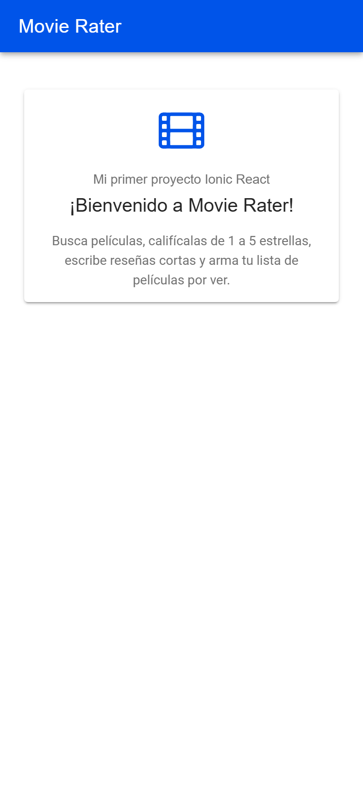

# Movie Rater — Entorno y primer proyecto Ionic React (Semana 6)

Actividad opcional de refuerzo · Programación Móvil · 2026-B
**Autor:** William Erney Collo Narvaez (`11William11`)

Monté el entorno de desarrollo y creé el primer proyecto de **Movie Rater** (la
app que planifiqué en el corte 1) con Ionic React. El proyecto está en
[`movie-rater-app/`](movie-rater-app/).

## Resultado

Pantalla inicial con el título cambiado de *Blank* a **Movie Rater**
(`ionic serve`, vista de celular 390 × 844):



## Pasos

### 1. Instalar Node.js LTS

Descargar el instalador LTS de <https://nodejs.org> y comprobar la instalación:

```bash
node --version   # v24.14.1
npm --version    # 11.11.0
```

### 2. Instalar el CLI de Ionic

```bash
npm install -g @ionic/cli
ionic --version  # 7.2.1
```

> Si no se quiere instalar nada global, todos los comandos funcionan igual con
> `npx @ionic/cli <comando>`.

### 3. Crear el proyecto

```bash
ionic start movie-rater-app blank --type=react
```

- `blank`: plantilla vacía, una sola página (`Home`).
- `--type=react`: Ionic con React + TypeScript + Vite.

El CLI crea la carpeta, instala las dependencias y deja listo Capacitor para
compilar a Android/iOS más adelante.

### 4. Ejecutarlo

```bash
cd movie-rater-app
ionic serve        # abre http://localhost:8100
```

En el navegador, con las herramientas de desarrollador (F12) → *Toggle device
toolbar*, se ve como en un celular.

### 5. Cambiar el título de la pantalla inicial

Edité [`src/pages/Home.tsx`](movie-rater-app/src/pages/Home.tsx):

| Antes | Después |
|---|---|
| `<IonTitle>Blank</IonTitle>` | `<IonTitle>Movie Rater</IonTitle>` (barra azul con `color="primary"`) |
| Componente `ExploreContainer` ("Ready to create an app?") | Tarjeta `IonCard` de bienvenida con un ícono de `ionicons` |

También cambié el `<title>` de `index.html` a *Movie Rater* y borré
`ExploreContainer`, que ya no se usa. Como `ionic serve` recarga en caliente, el
cambio se ve al guardar el archivo.

### 6. Comprobar que funciona

```bash
npm run build          # compila TypeScript y genera dist/ sin errores
npx vitest run         # 2 pruebas: la app renderiza y muestra "Movie Rater"
```

```
 ✓ src/App.test.tsx (2 tests)
 Test Files  1 passed (1)
      Tests  2 passed (2)
```

## Estructura del proyecto

```
movie-rater-app/
├── src/
│   ├── App.tsx            rutas (IonReactRouter) → Home en "/home"
│   ├── App.test.tsx       pruebas con Vitest + Testing Library
│   ├── main.tsx           punto de entrada de React
│   ├── pages/Home.tsx     pantalla inicial modificada
│   └── theme/variables.css
├── capacitor.config.ts    configuración para compilar a Android/iOS
├── ionic.config.json
├── package.json
└── vite.config.ts
```

Para clonar y correrlo: `cd movie-rater-app && npm install && ionic serve`
(`node_modules/` no se sube al repositorio).
